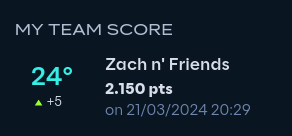

# Reply Code Challenge solutions

Welcome to Reply Code 2024, ***WE WIN THESEEEEEEE!!!!!!!!!!!!!!***

All pass on question 1 - <a href="https://github.com/Siriusmart/reply2024/tree/master/mikado" target=_blank>mikado</a> 
All pass on question 2 - <a href="https://github.com/Siriusmart/reply2024/tree/master/hounds" target=_blank>hounds</a> 
Passed first and second difficulty on question 3 - <a href="https://github.com/Siriusmart/reply2024/tree/master/pipes" target=_blank>pipes</a>

> Note that solution to question 3 uses heuristics among other stuff, it is extremely unreliable and requires tweaking depending on the size of map/speed required.

And of course, [input parsers and output handlers](https://github.com/Siriusmart/reply2024/tree/master/parsers) are prewritten to save time.

GGWP guys
